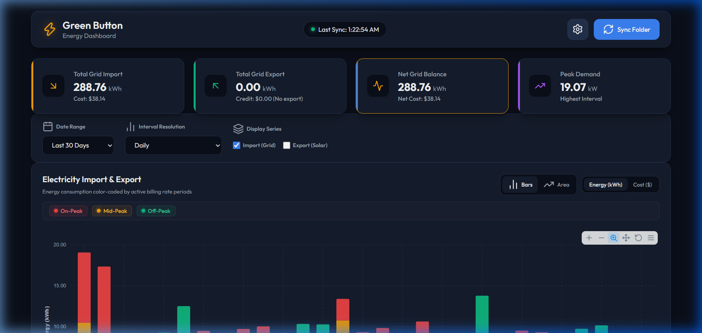
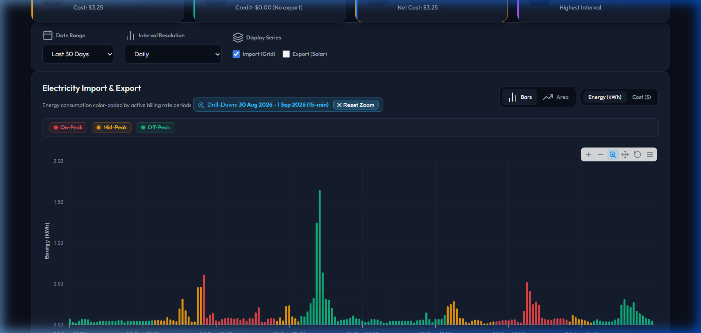
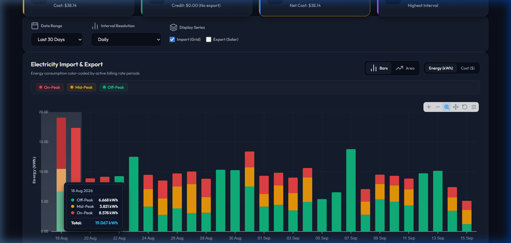
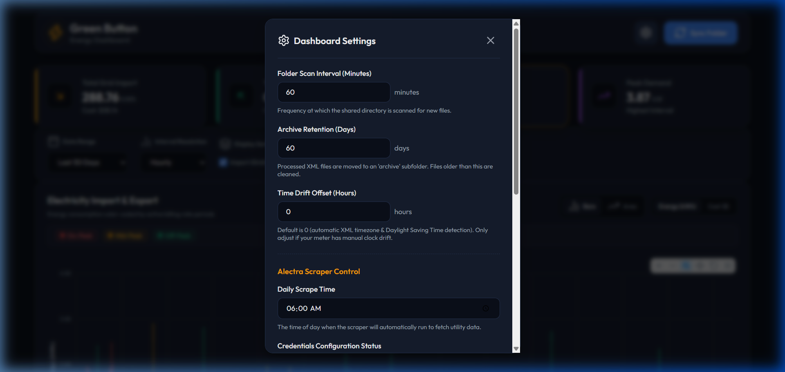

<p align="center">
  
</p>

# Alectra Green Button Energy Dashboard ⚡

[](https://github.com/akhilgupta2007/alectra_usage_dashboard/actions/workflows/docker-publish.yml)


A modern, self-hosted energy analytics dashboard and automated scraper for **Alectra Utilities** customers. Built with FastAPI, SQLite, Playwright, and ApexCharts, packaged into a lightweight, memory-efficient Docker container.

Visualize your 15-minute smart meter intervals, track Time-of-Use (TOU) and Tiered electricity costs, monitor net grid balance (solar import vs. export), and integrate directly with AI assistants via the **Model Context Protocol (MCP)**.

---

## ✨ Features

- **Alectra Tariff & Full Itemized Billing**:
  - Reconciles your actual Alectra utility bill to the penny.
  - Automatically calculates Electricity Commodity supply, Fixed Distribution ($35.38/mo prorated), Transmission & Volumetric Delivery ($0.0175/kWh) with official 1.0341 Line Loss multiplier, IESO Wholesale Regulatory charges ($0.005983/kWh), 13% HST, and the 23.5% Ontario Electricity Rebate (OER) provincial credit.
- **Smart Rate Advisor (All-Inclusive 3-Plan Simulation)**:
  - Compares your real 15-minute smart meter intervals across all three Ontario plans: **Standard Time-of-Use (TOU)**, **Ultra-Low Overnight (ULO)**, and **Tiered Pricing**.
  - High-precision timestamp classification with Ontario statutory holidays and weekend detection (no guesses).
  - Season-aware & prorated tier thresholds (Summer 600 kWh vs. Winter 1,000 kWh).
  - Displays the complete all-inclusive estimated bill with supply subtitles (`Supply: $XX.XX`) and calculates true net out-of-pocket savings.
- **Runtime Billing & OEB Rate Settings**:
  - Dedicated in-app modal to review and customize Alectra delivery parameters, loss factors, HST, OER percentages, and seasonal OEB rate schedules without editing code.
- **Automated Daily Scraping**: Built-in headless Playwright bot that logs into the Alectra Green Button portal on a configurable schedule (e.g., daily at 06:00 AM) and automatically downloads your latest energy usage XML.
- **Manual XML Import**: Drag-and-drop any standard Green Button XML file directly into the web UI for instant parsing and archiving.
- **Dynamic Granularity & 15-Minute Drill-Down**:
  - **Auto-Switching View**: Displays Daily rollups for multi-week/monthly spans, Hourly for 1–2 weeks, and 15-minute resolution for 1–2 days.
  - **Zoom & Click Drill-Down**: Drag a zoom box over a single day on the 30-day chart or click any daily bar to instantly roll down to granular 15-minute interval profiles (up to 96 bars/day) with one-click zoom reset.
- **Ontario Time-of-Use (TOU) & Tier Breakdown**:
  - Automatically color-codes intervals by On-Peak, Mid-Peak, Off-Peak, and Ultra-Low Overnight (ULO) periods or Consumption Tiers.
  - Interactive tooltips showing breakdown, total import, and net balance on hover.
  - Dedicated breakdown summary card with inline progress tracks and zero wasted void space.
- **Lightweight & Self-Host Ready**:
  - Strict **< 500 MB RAM** footprint.
  - SQLite with Write-Ahead Logging (WAL) and C-level query aggregation for instant loading across years of data.
  - No external database or cloud subscription required.
- **AI Assistant Integration (MCP Server v1.1.0)**:
  - Built-in Model Context Protocol (MCP) server over SSE (`/sse`) and Stdio (`mcp_server.py`).
  - High-precision interval parsing, rate comparisons, and itemized billing queries for Claude Desktop, Cursor, Antigravity, and Home Assistant Assist.

---

## 📸 Screenshots & Showcase

### 1. Interactive Multi-Day Energy Dashboard (Ontario TOU Rates)


### 2. Dynamic 15-Minute Zoom & Click Drill-Down


### 3. Detailed Interval Tooltips & Runtime Settings
| Interactive Hover Tooltip with Total Row | Scraper, Time-Shift & Settings Modal |
| :---: | :---: |
|  |  |

---

## 🚀 Deployment Options

### Option 1: Deploy with Pre-built Image (Container Registry)

You can deploy immediately on any Docker host (NAS, Synology, Unraid, Raspberry Pi, VPS) using only a `docker-compose.yml` file without needing the source code:

```yaml
version: '3.8'

services:
  dashboard:
    image: ghcr.io/akhilgupta2007/alectra_usage_dashboard:latest
    container_name: alectra_usage_dashboard
    ports:
      - "8080:8000"
    volumes:
      - ./data:/app/data
    environment:
      - TZ=America/Toronto
      - ACCOUNT_NAME=Your Full Name
      - ACCOUNT_NUMBER=123456789
      - PHONE_NUMBER=905-555-1234
      - METER_NUMBER=
      - SCRAPE_ON_STARTUP=false
    restart: unless-stopped
    deploy:
      resources:
        limits:
          memory: 500M
```

Run:
```bash
docker compose pull
docker compose up -d
```

Or deploy with a single `docker run` command:
```bash
docker run -d \
  --name alectra_dashboard \
  -p 8080:8000 \
  -v $(pwd)/data:/app/data \
  -e TZ=America/Toronto \
  -e ACCOUNT_NAME="Your Full Name" \
  -e ACCOUNT_NUMBER="123456789" \
  -e PHONE_NUMBER="905-555-1234" \
  --memory=500m \
  --restart unless-stopped \
  ghcr.io/akhilgupta2007/alectra_usage_dashboard:latest
```

---

### Option 2: Build & Run from Source (Docker Compose)

#### 1. Clone the Repository
```bash
git clone https://github.com/akhilgupta2007/alectra_usage_dashboard.git
cd alectra_usage_dashboard
```

#### 2. Configure Environment Variables
```bash
cp .env.example .env
```
Edit `.env` (or `docker-compose.yml`) with your Alectra portal credentials.

#### 3. Build & Start the Container
```bash
docker compose up -d --build
```

Access the dashboard at `http://localhost:8080`.

---

## 📦 Building & Publishing to Container Registry

### A. Automated via GitHub Actions
This repository includes [`.github/workflows/docker-publish.yml`](.github/workflows/docker-publish.yml). Every time you push a commit or release tag to GitHub:
1. GitHub Actions automatically builds the Docker image.
2. The image is published directly to **GitHub Container Registry**:
   ```
   ghcr.io/akhilgupta2007/alectra_usage_dashboard:latest
   ```

### B. Manual Build & Push (GHCR / Docker Hub)

To manually push to GitHub Container Registry:
```bash
# 1. Log in to GHCR with your GitHub Personal Access Token (PAT with write:packages)
echo $CR_PAT | docker login ghcr.io -u akhilgupta2007 --password-stdin

# 2. Build and tag
docker build -t ghcr.io/akhilgupta2007/alectra_usage_dashboard:latest .

# 3. Push
docker push ghcr.io/akhilgupta2007/alectra_usage_dashboard:latest
```

---

## ⚙️ Configuration Reference

### Environment Variables

| Variable | Description | Default |
| :--- | :--- | :--- |
| `ACCOUNT_NAME` | Primary account holder name as registered with Alectra Utilities. | *(Required for scraper)* |
| `ACCOUNT_NUMBER` | Your Alectra account number. | *(Required for scraper)* |
| `PHONE_NUMBER` | Phone number associated with your Alectra account for verification. | *(Required for scraper)* |
| `METER_NUMBER` | Specific meter number if your account has multiple meters. | `""` (First meter) |
| `LOGIN_PORTAL_URL` | Alectra Green Button portal authentication URL. | `https://alectrautilitiesgbportal.savagedata.com/Connect/Authorize` |
| `TZ` | Timezone for scheduled scrapes and interval conversions. | `America/Toronto` |
| `SCRAPE_ON_STARTUP`| Trigger an immediate scrape when the container starts. | `false` |
| `DATABASE_PATH` | Path to SQLite database file. | `green_button.db` |
| `SCAN_FOLDER_PATH` | Directory where downloaded/uploaded XML files are processed. | `/app/data` |

### In-App Settings Modal
Click the **Settings (⚙️)** button in the top navigation bar to configure runtime parameters without restarting the container:
- **Scan Interval**: How frequently the background service checks `/app/data` for new XML files (default: `60 minutes`).
- **Archive Retention**: How many days to keep processed XML files in `/app/data/archive` before cleanup (default: `60 days`).
- **Green Button Time-Shift**: Allows manual hourly UTC offset adjustment if your utility provider exports interval data in UTC face values.
- **Scheduled Scrape Run Time**: Time of day (HH:MM in 24h format) for the automated daily scrape.
- **Wipe & Re-import**: Clears the SQLite database and re-processes all XML files from the archive directory.

---

## 🤖 AI Integration (Model Context Protocol / MCP)

The dashboard includes a full **Model Context Protocol (MCP)** server enabling AI tools to inspect your energy metrics.

### Exposed MCP Tools:
1. `get_system_status()`: Database statistics, interval counts, date bounds, active rate plan, and scraper status.
2. `get_billing_parameters()`: Active Alectra fixed/volumetric delivery rates, line loss factor (1.0341), regulatory charges, HST, and OER rebate percentages.
3. `get_bill_estimate(start_date, end_date)`: Complete itemized Alectra billing statement (Commodity, Delivery, Regulatory, HST, OER credit, Total Due).
4. `compare_rate_plans(start_date, end_date)`: 3-plan simulation (Standard TOU, ULO, Tiered) calculating full all-inclusive bills, commodity subtitles, and true net savings.
5. `get_energy_summary(start_date, end_date)`: Consumption (kWh and $), solar export, peak demand, and multi-plan breakdowns.
6. `get_rate_breakdown(start_date, end_date)`: Percentage distribution and effective rate ($/kWh) for active rate tiers, ULO slots, and consumption tiers.
7. `get_interval_readings(start_date, end_date, resolution, limit)`: Time-series intervals (`15min`, `1h`, or `1d` with complete On-Peak, Mid-Peak, and Off-Peak breakdown).
8. `trigger_folder_sync()`: Triggers an immediate scan and ingestion of new Green Button XML files.

### Antigravity IDE Configuration
Add the server to your project's `.agents/mcp_config.json` (or global `~/.gemini/config/mcp_config.json`):

```json
{
  "mcpServers": {
    "alectra-energy": {
      "serverUrl": "http://localhost:8080/sse"
    }
  }
}
```

Or for direct local stdio execution:
```json
{
  "mcpServers": {
    "alectra-energy": {
      "command": "python",
      "args": ["${workspaceFolder}/mcp_server.py"],
      "env": {
        "DATABASE_PATH": "${workspaceFolder}/green_button.db"
      }
    }
  }
}
```

### Claude Desktop Configuration
Add the following to your `claude_desktop_config.json`:
```json
{
  "mcpServers": {
    "alectra-dashboard": {
      "command": "python",
      "args": ["/path/to/alectra_usage_dashboard/mcp_server.py"],
      "env": {
        "DATABASE_PATH": "/path/to/alectra_usage_dashboard/green_button.db"
      }
    }
  }
}
```

### Home Assistant Integration

You can integrate your dashboard with **Home Assistant** in two powerful ways:

#### Option A: Home Assistant Assist (Voice & Chat LLM via MCP)
If you use Home Assistant Assist with an LLM (such as **Extended OpenAI Conversation**, **Local Ollama**, or the **Home Assistant MCP Client** integration):
1. In Home Assistant, open your LLM conversation agent settings or MCP client configuration.
2. Add a new **SSE MCP Server**:
   - **Name**: `Alectra Energy`
   - **Server URL**: `http://<YOUR_DOCKER_HOST_IP>:8080/sse`
   - **Transport**: `SSE (Server-Sent Events)`
3. Enable the exposed tools (`get_energy_summary`, `get_rate_breakdown`, `get_peak_demand`, `get_system_status`).
4. You can now ask Assist via voice or text:
   - *"How much electricity did we use yesterday?"*
   - *"What was our highest peak demand this week?"*
   - *"Give me a breakdown of our On-Peak vs Off-Peak electricity cost."*

#### Option B: Home Assistant REST Sensor (Native Dashboard Entities)
To pull your latest Alectra usage and costs into Home Assistant entity cards or automations, add the following to your `configuration.yaml`:

```yaml
sensor:
  - platform: rest
    name: "Alectra Energy Latest Day"
    resource: "http://<YOUR_DOCKER_HOST_IP>:8080/api/data?date_range=latest_day&resolution=1d"
    scan_interval: 3600 # Check every hour
    value_template: "{{ value_json.consumption[0][1] | round(2) if value_json.consumption | length > 0 else 0 }}"
    unit_of_measurement: "kWh"
    device_class: energy
    state_class: total
    json_attributes_path: "$.tou_summary"
    json_attributes:
      - on_peak_kwh
      - mid_peak_kwh
      - off_peak_kwh
      - ulo_kwh
      - on_peak_cost
      - mid_peak_cost
      - off_peak_cost
      - ulo_cost

  - platform: rest
    name: "Alectra Energy Latest Day Cost"
    resource: "http://<YOUR_DOCKER_HOST_IP>:8080/api/data?date_range=latest_day&resolution=1d"
    scan_interval: 3600
    value_template: "{{ value_json.consumption_cost[0][1] | round(2) if value_json.consumption_cost | length > 0 else 0 }}"
    unit_of_measurement: "$"
    device_class: monetary
```

### Generic SSE Transport (Cursor / Web LLM Clients)
Connect any MCP client supporting HTTP Server-Sent Events to:
```
http://<YOUR_DOCKER_HOST_IP>:8080/sse
```

---

## 🛠️ Local Development (Without Docker)

### Prerequisites
- Python 3.10+
- Node.js (optional, only for linting)
- Playwright Chromium browser

### Setup
```bash
# 1. Create and activate a virtual environment
python -m venv .venv
source .venv/bin/activate  # On Windows: .venv\Scripts\activate

# 2. Install dependencies
pip install -r requirements.txt
playwright install chromium

# 3. Start the application
python -m uvicorn main:app --host 127.0.0.1 --port 8000 --reload
```

Open `http://127.0.0.1:8000` in your browser.

---

## 🔒 Security & Privacy

- **100% Local & Self-Hosted**: All meter readings, timestamps, and cost data remain inside your local SQLite database or Docker volume. No external analytics, telemetry, or third-party servers are contacted.
- **Credentials Handling**: Scraper credentials are read strictly from environment variables and never logged or exposed via API endpoints.
- **Git Ready**: A pre-configured `.gitignore` ensures that database files (`*.db`), downloaded XML files (`data/`), Python bytecode (`__pycache__/`), and credentials files (`.env`) are never committed to version control.

---

## 📜 Release Notes & Changelog

### `v1.1.0` (Latest Release)
- **Alectra Billing & Tariff Analytics**:
  - Full penny-accurate statement reconciliation (Electricity Supply, Fixed Distribution, Volumetric Delivery with 1.0341 line loss factor, Wholesale Regulatory charges, 13% HST, and 23.5% OER rebate credit).
  - Smart Rate Advisor: Simulated 3-plan comparison across Standard TOU, Ultra-Low Overnight (ULO), and Tiered Pricing with prorated seasonal thresholds (Summer 600 kWh vs Winter 1,000 kWh).
  - Runtime Settings Modal: Allows editing fixed delivery, volumetric rates, line loss factors, and OEB rate schedules without container restarts.
- **Model Context Protocol (MCP Server v1.1.0)**:
  - Added SSE endpoint at `/sse` and Stdio integration (`mcp_server.py`) exposing 8 high-precision analytical tools for Claude Desktop, Antigravity, Cursor, and Home Assistant Assist.
- **Memory & Reliability Optimizations**:
  - Enforced `MALLOC_ARENA_MAX=2` and glibc `malloc_trim(0)` garbage collection routines to prevent heap fragmentation, keeping RAM strictly `< 500 MB`.
  - Added 3-attempt automated scraper retry with smart delay escalation and phone number auto-formatting.
- **Version Tracking & Observability**:
  - Added visible `v1.1.0` release badge in dashboard header and settings modal.
  - Added ASCII startup version banner to Docker stdout logs on container initialization.
  - Added `"version": "v1.1.0"` to the `/api/status` API endpoint.

---

## 📄 License

This project is licensed under the **MIT License**. You are free to modify, distribute, and self-host for personal or commercial use.
